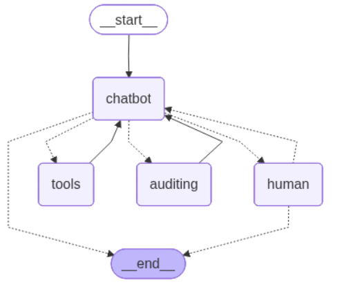

# 📊 Projet : Système d'Audit et Conformité ISO 27001 avec Agent LangGraph

## 🧩 Objectif du projet

Ce projet implémente un Assistant d'audit conversationnel spécialisé en conformité et cybersécurité, conçu pour aider les auditeurs à évaluer la conformité du système d'information d'une entreprise selon la norme ISO 27001.

---

## 🖼️ Architecture du Système

Le diagramme représente le flux de traitement des requêtes d'audit :


### Vue globale



---

## 🧰 Outils et technologies

| Outil                                | Usage                                               |
| ------------------------------------ | --------------------------------------------------- |
| **Chroma DB**                        | Base de données vectorielles                        |
| **Python**                           | Dévéloppement                                       |
| **LangGraph**                        | Orchestration des rôles                             |
| **Gemeni API**                       | Pour utiliser flash-2.0                             |


---

## 🚀 Comment exécuter le projet

### 1. Cloner le dépôt

```bash
git git clone git@github.com:Portfolio20224/audit-compliance-ai.git
cd audit-compliance-ai
```

### 2. Installer les dépendances

```bash
poetry install
```


